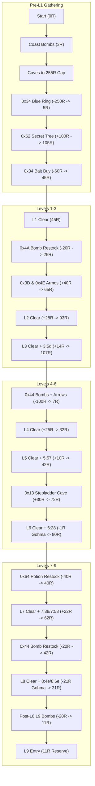

# Zelda I Rupee Budget & Spending Schedule

**Current measurement (rr-ps7.9):** Schedule A is a proposal, not a verified
route. `bait_compose_poweron3` bought Bait naturally after the 0x62 payout
(105R→45R, Food 0→1, zero inventory writes) and reached L4, but the arrow
shop at 0x4A failed with 15R against an 80R price. The proposed L2 Armos
income is not yet present in that continuous tape. The pre-L1 Bait stop also
displaces the 68R red potion, so later health and shop balances need a new
power-on measurement.

**Bead:** rr-ps7.6  
**Epic:** rr-ps7 (Zelda I Full-Game Route & Inventory-Clean Gate)  
**Parent / Related Issues:** rr-8t4.5 (Bait at `0x34`), rr-ps7.7 (Wooden Arrows), rr-thlc (Second Potion Restock)  
**Baseline Run:** `nes/zelda_i/recordings/natl8_3.json` (238,187 frames continuous power-on through Level 8 leave)  
**Living Pointers:** [STATUS.md](STATUS.md) · [plan.md](plan.md) · [PRE_L1.md](PRE_L1.md) · [ASSIST_CONTRACT.md](ASSIST_CONTRACT.md) · [RUN_METRICS.md](RUN_METRICS.md)

---

## 1. Executive Summary

As the Zelda I NES route moves from Survival health-assisted automation toward the **Inventory-Clean gate** (zero progression/item pokes, natural inventory only), rupees become the strict binding constraint.

In the baseline continuous power-on run through Level 8 (`natl8_3`, 238,187 frames), four progression items were granted by assist writes rather than funded naturally:
1. **Wooden Arrows (`$0659`):** Granted via assist poke in L6 room `0x1C` (`poke_arrows=True`, frame 185,382). Needs a natural **80R** purchase at a `CAVE_SHOP_ARROWS` shop (screen `0x4A` or `0x44`) between Level 1 and Level 6.
2. **Food / Bait (`$065D`):** Granted via a 1-frame survival fixture poke in stage `level7_bait_purchase` (`poke_food=1`, frame 192,234). Needs a natural **60R** purchase at `0x34` (`CAVE_SHOP_SPECIAL`).
3. **Second Potion (`$065E`):** Carried life potion was not refilled after L5/L6; `potion_restock_l6` was skipped (`price=40R`). A blue potion refill costs **40R**.
4. **Level 9 Bombs (`$0658`):** Link leaves Level 8 with `bombs=0`. Opening Spectacle Rock (`0x05`) and traversing Level 9 interior walls requires an overworld bomb purchase of **20R** (4 bombs).

Total new expenditure needed: **200R** (`80 + 60 + 40 + 20`), plus an **arrow shooting reserve** for Gohma (1R), Blue Gohma (21R on `natl8_3`), and Ganon (1–2R).

This document:
- Details the exact wallet balance (`ADDR_RUPEES`, `$066D`) across every major milestone in `natl8_3`.
- Documents all **257R** of currently skipped natural income sources: 6 unopened overworld caves (140R), 7 uncollected dungeon room 5-rupee items (35R), and 103 unpicked floor drops (82R).
- Designs and proves three feasible income and spending schedules that respect the **255R hard cap** (zero overflow waste) and guarantee positive wallet balances at every shop arrival.
- Recommends **Schedule A** (Pre-L1 Bait at `0x34` + Pre-L4 Arrows at `0x44` + Post-L6 Potion at `0x64`) as the primary route, requiring zero extra caves in pre-L1, natural Armos pickups next to Level 2, and merging the arrow purchase into an existing bomb restock.

---

## 2. Milestone Wallet Ledger of `natl8_3.json`

The table below traces Link's exact wallet balance at every milestone of the 238,187-frame continuous run `natl8_3.json`. Data is extracted directly from the stage boundaries, `ledger["gains"]`, `resource_audit["shops"]`, and controller leftovers.

| Milestone / Stage | Frames | Screen / Room | Stage Wallet Delta | Resulting Wallet | Description & Item Event |
|---|---|---|---|---|---|
| **Power-On Spawn** | 199 | `0:77` | +0 | **0R** | Link spawns with 0 rupees, 3 hearts, 0 bombs, 0 keys. |
| Coast Gathering (`bomb_walk`, `bomb_topup`) | 948–20,300 | `0:79`–`0:6F` | +23 | **23R** | Picks 11 floor drops along south-east coast: 7×1R + 3×5R + 1×1R = 23R. |
| Coast Bomb Buy (`bomb_buy`) | 20,300–20,816 | `0:6F` | -20 | **3R** | Buys 4 bombs for 20R (`rupees_at_buy=23`, `rupees_out=3`). |
| Walk to 0x2D (`rupees_2d`) | 21,019–28,967 | `0:7C`–`0:2D` | +32 | **35R** | Heart at `0x7B`, heart at `0x2C`. Picks 2 drops (+2R). Bombs rock at `0x2D` (+30R cave). |
| Northeast 100R Cave (`ne_100`) | 29,135–31,267 | `0:0F` | +100 | **135R** | Unopened open cave at `0x0F` (+100R gift). |
| Blue Candle Buy (`candle`) | 32,930–34,575 | `0:0C` | -60 | **75R** | Buys Blue Candle for 60R at open shop `0x0C` (`rupees_at_buy=135`, `rupees_out=75`). |
| White Sword Walk (`rupees_28`, `white`) | 34,911–39,943 | `0:28`–`0:0A` | +30 | **105R** | Burns tree at `0x28` (+30R cave). Takes White Sword at `0x0A`. |
| South Woods Caves (`rupees_48`, `rupees_5b`) | 40,594–47,064 | `0:48`–`0:5B` | +45 | **150R** | Burns `0x48` (+30R) + 5R drop. Takes heart `0x47`. Burns `0x5B` (+10R). |
| Gap 100R Cave (`rupees_6b`) | 47,156–47,782 | `0:6B` | +100 | **250R** | Burns tree at `0x6B` (+100R cave). Counter rises to 250R. |
| Ring Road Cave (`rupees_56`) | 47,874–49,929 | `0:56` | +5 (capped) | **255R** | Burns tree at `0x56` (+10R cave). Wallet hits **255R hard cap**; 5R wasted. |
| **Blue Ring Buy (`ring`)** | 50,021–52,761 | `0:34` | -250 | **5R** | Touches Armos at `0x34`. Buys Blue Ring for 250R (`rupees_at_buy=255`, `rupees_out=5`). |
| Post-Ring 100R Cave (`rupees_62`) | 52,864–54,496 | `0:62` | +100 | **105R** | Burns column tree at `0x62` (+100R cave). Wallet counts up from 5R to 105R. |
| **Potion Buy (`potion`)** | 54,588–56,339 | `0:64` | -68 | **37R** | Buys Red Life Potion for 68R at shop `0x64` (`rupees_at_buy=105`, `rupees_out=37`). |
| Transit to L1 (`walk_37`, `enter_level1`) | 56,529–60,614 | `0:64`–`0:37` | +0 | **37R** | Crosses `0x39` pond; arrives at Level 1 mouth with 37R. |
| **Level 1 Entry** | 60,506 | `1:73` | +0 | **37R** | Enters L1 with 37R, 4 bombs, 6 heart containers. |
| Level 1 Clear (`triforce_shard_1`, `settle_l1_tf`) | 60,614–77,609 | Level 1 | +0 | **37R** | Clears Bow, Aquamentus, TF shard 1. Zero rupee drops picked in L1. |
| **Level 1 Exit** | 77,609 | `0:37` | +0 | **37R** | Leaves L1 into overworld carrying exactly 37R. |
| **0x4A Bomb Shop Buy (`bomb_shop_4a`)** | 77,609–79,603 | `0:4A` | -20 | **17R** | Buys 4 bombs for 20R (`rupees_at_buy=37`, `rupees_out=17`). |
| Walk to L2 (`enter_level2`) | 79,793–83,327 | `0:4A`–`0:3C` | +0 | **17R** | Traverses maze `0x5C` to Level 2 mouth at `0x3C`. |
| **Level 2 Entry** | 83,327 | `2:7e` | +0 | **17R** | Enters L2 with 17R, 8 bombs. |
| Level 2 Clear (`collect_tf`, `settle_l2_tf`) | 83,327–96,730 | Level 2 | +28 | **45R** | Clears Magical Boomerang, Dodongo, TF shard 2. Picks 12 enemy drops (+28R: 4×5R + 8×1R). |
| **Level 2 Exit** | 96,730 | `0:3C` | +0 | **45R** | Leaves L2 carrying 45R. |
| Walk to L3 (`enter_level3`) | 96,730–101,765 | `0:3C`–`0:74` | +0 | **45R** | Traverses west through `0x55`–`0x64` to Level 3 at `0x74`. |
| **Level 3 Entry** | 101,765 | `3:74` | +0 | **45R** | Enters L3 with 45R, 3 bombs. |
| Level 3 Clear (`level3_boss_tf`, `settle_l3_tf`) | 101,765–112,241 | Level 3 | +9 | **54R** | Clears Raft, Manhandla, TF shard 3. Picks 5 enemy drops (+9R: 1×5R + 4×1R). Leaves room `3:5d` rupee5 behind. |
| **Level 3 Exit** | 112,241 | `0:74` | +0 | **54R** | Leaves L3 carrying 54R. |
| Potion Restock L3 (`potion_restock_l3`) | 112,241–112,242 | `0:64` | +0 | **54R** | Skipped: red potion already held (`potion_restock_nothing_to_buy`). |
| **0x44 Bomb Restock (`bomb_restock_l3`)** | 112,243–113,949 | `0:44` | -20 | **34R** | Buys 4 bombs for 20R (`rupees_at_buy=54`, `rupees_out=34`). |
| Walk to L4 (`enter_level4`) | 114,139–115,710 | `0:44`–`0:45` | +0 | **34R** | Rafts across river to Level 4 mouth at `0x45`. |
| **Level 4 Entry** | 115,710 | `4:74` | +0 | **34R** | Enters L4 with 34R, 5 bombs. |
| Level 4 Clear (`level4_gleeok_tf`, `settle_l4_tf`) | 115,710–135,525 | Level 4 | +25 | **59R** | Clears Stepladder, 2-headed Gleeok, TF shard 4. Picks 9 enemy drops (+25R: 3×5R + 10×1R). |
| **Level 4 Exit** | 135,525 | `0:45` | +0 | **59R** | Leaves L4 carrying 59R. |
| Walk to L5 (`enter_level5`) | 135,525–140,311 | `0:45`–`0:0B` | +5 | **64R** | Overworld transit north to `0x0B`. Picks 5R floor drop in room `0:2b` (frame 138,296). |
| **Level 5 Entry** | 140,311 | `5:66` | +0 | **64R** | Enters L5 with 64R, 4 bombs. |
| Level 5 Clear (`level5_whistle_0x04`, `settle_l5_tf`) | 140,311–164,888 | Level 5 | +0 | **64R** | Clears Whistle, Digdogger, TF shard 5. Zero rupee drops picked. Leaves room `5:57` rupee5 behind. |
| **Level 5 Exit** | 164,888 | `0:0B` | +0 | **64R** | Leaves L5 carrying 64R. |
| Walk to L6 (`enter_level6`) | 164,888–169,226 | `0:0B`–`0:22` | +0 | **64R** | Overworld transit west to graveyard `0x22`. |
| **Level 6 Entry** | 169,226 | `6:79` | +0 | **64R** | Enters L6 with 64R, 8 bombs. |
| Level 6 Combat & Drops | 169,226–185,382 | Level 6 | +4 | **68R** | Clears Magic Rod. Picks 4 enemy rupee drops (+4R: rooms `6:7a`, `6:78`, `6:68`, `6:3a`). Leaves room `6:28` rupee5 behind. |
| Level 6 Arrow Poke (`assist`) | 185,382 | `6:1c` | +0 | 68R | **Assist write:** writes `arrows=1` before Gohma (unfunded shortcut). |
| Level 6 Gohma Arrow Shot | 185,382–185,499 | `6:1c` | -1 | **67R** | Link fires 1 wooden arrow into Gohma's open eye (`rupees: 68 -> 67`). |
| Level 6 Clear & Exit (`level6_exit_ow`) | 185,499–186,376 | `6:20`–`0:22` | +0 | **67R** | Clears TF shard 6. Leaves L6 carrying 67R. |
| **Level 6 Exit** | 186,376 | `0:22` | +0 | **67R** | Leaves L6 carrying 67R. |
| Post-L6 Transit & Recorder Warp | 186,376–190,353 | `0:22`–`0:45` | +0 | **67R** | Blows Recorder, whirlwind warps Link to `0x45` (Level 4 entrance). |
| Potion Restock L6 (`potion_restock_l6`) | 190,353–190,354 | `0:64` | +0 | **67R** | Skipped: red potion still held (`potion_restock_nothing_to_buy`). |
| Level 7 Bait Poke (`assist`) | 192,234 | `0:42` | +0 | 67R | **Assist write:** writes `food=1` at pond (1-frame fixture shortcut; 0R spent). |
| Pond Drain & Entry (`level7_pond_drain_entry`) | 192,235–192,709 | `0:42` | +0 | **67R** | Blows Whistle to drain pond; enters Level 7 mouth. |
| **Level 7 Entry** | 192,709 | `7:69` | +0 | **67R** | Enters L7 with 67R, 8 bombs, assist-granted bait. |
| Level 7 Clear (`level7_shard_and_settled_leave`) | 192,709–212,853 | Level 7 | +12 | **79R** | Feeds Goriya, clears Red Candle, Digdogger, Aquamentus, TF shard 7. Picks 4 drops (+12R: 2×5R + 2×1R). Leaves rooms `7:38`, `7:58` rupee5 behind. |
| **Level 7 Exit** | 212,853 | `0:42` | +0 | **79R** | Leaves L7 carrying 79R. |
| Walk to 0x44 Shop (`level8_post_l7_to_shop`) | 212,853–213,914 | `0:42`–`0:44` | +0 | **79R** | Transit east to `0x44` shop cave. |
| **0x44 Bomb Restock (`bomb_restock_l7`)** | 213,914–214,734 | `0:44` | -20 | **59R** | Arrives with 79R. Buys 4 bombs for 20R (`rupees_at_buy=79`, resting wallet counts down to 59R; leftover in-cave reads 60R during countdown). |
| Walk to L8 Bush (`level8_burn_bush_enter`) | 214,924–219,393 | `0:44`–`0:6D` | +0 | **59R** | Burns bush at `0x6D` with Red Candle; enters Level 8. |
| **Level 8 Entry** | 219,393 | `8:5e` | +0 | **59R** | Enters L8 carrying 59R, 4 bombs. |
| Level 8 Darknut & Key Rooms | 219,393–225,538 | Level 8 | +0 | **59R** | Bombs Manhandla; clears Darknuts. Zero rupee drops picked. |
| Level 8 Blue Gohma Fight (`level8_blue_gohma`) | 225,538–227,255 | `8:1e` | -21 | **38R** | Fights Blue Gohma (3 connecting wooden arrow hits required). Controller fires **21 arrow shots** (`shots=21`, leftover `shots: 21`). Wallet: `59 - 21 = 38R`. |
| Level 8 Magic Key & Suffix Clear | 227,255–237,620 | Level 8 | +0 | **38R** | Takes Magical Key at `8:0f`, clears 4-headed Gleeok, takes HC and TF shard 8. Leaves rooms `8:4e`, `8:6e` rupee5 behind. Zero drops picked. |
| **Level 8 Exit (`level8_ow_leave_settle`)** | 237,620–238,187 | `0:6D` | +0 | **38R** | Fanfare settles; Link exits into overworld `0x6D` carrying **exactly 38R**. |

### 2.1 Accounting Reconciliation
The mathematical consistency of `natl8_3` is 100% verified:
$$\text{L7 Exit (79R)} - \text{0x44 Bomb Buy (20R)} - \text{Blue Gohma (21 Arrow Shots)} = \mathbf{38R} = \text{Final Wallet}$$

---

## 3. Unused Natural Rupee Income Sources

`natl8_3` left behind significant natural capital because the earlier route prioritized speed over rupee accumulation. A total of **257R** of natural income is available across three distinct categories:

### 3.1 Unopened Secret Rupee Caves & Armos Caves (140R)

Six caves on or adjacent to the natural transit path were left completely untouched:

| Screen | Kind / ID | Open Method | Payout | Coordinates | Requirement | Routing & Proximity Context |
|---|---|---|---|---|---|---|
| `0x67` | `CAVE_RUPEES_30` | Bomb Rock | **30R** | (112, 80) UP | 1 Bomb | Exactly 1 screen North of the Start screen (`0x77`). Directly on column 7 transit between coast/pond and Level 1 (`0x37`). |
| `0x71` | `CAVE_RUPEES_30` | Bomb Rock | **30R** | (80, 80) UP | 1 Bomb | South-west corner screen `0x71`. Immediately adjacent (1 screen South) of `0x62` (+100R tree) and 1 screen West of `0x72` (L7 pond / warp). |
| `0x13` | `CAVE_RUPEES_30` | Bomb Rock | **30R** | (32, 80) UP | Stepladder + 1 Bomb | Top-left river area `0x13` (west of river). Passed on high-mountain transit from Level 5 (`0x0B`) to Level 6 (`0x22`) or Level 9 (`0x05`). Stepladder acquired in L4. |
| `0x51` | `CAVE_RUPEES_10` | Burn Tree | **10R** | (144, 160) DOWN | Candle | Screen `0x51`, 1 screen North-West of `0x62`. Accessible during pre-L1 or L7 approach. |
| `0x3D` | `CAVE_RUPEES_30` | Touch Armos | **30R** | Armos statue | **None (0 items)** | **Directly 1 screen East of Level 2 entrance (`0x3C`)**. Touching the right Armos opens the cave. Zero bombs, zero candles, zero keys. |
| `0x4E` | `CAVE_RUPEES_10` | Touch Armos | **10R** | Armos statue | **None (0 items)** | Screen `0x4E`, directly 1 screen East of `0x4D` on the Level 2 approach/exit transit. Zero consumables. |
| **Total** | | | **140R** | | | **40R adjacent to L2, 60R near 0x62/start, 30R near L5/L6, 10R woods.** |

### 3.2 Uncollected Dungeon Room Rupee5 Items (35R)

In Zelda 1, clear or item flags in specific dungeon rooms spawn a 5-rupee room item upon enemy defeat or entrance. In `natl8_3`, Link visited all seven of these rooms (`visits=1`), but the controller walked out without picking up the item:

| Dungeon Room | Item | Visits in `natl8_3` | Taken? | Value | Strategic Note |
|---|---|---|---|---|---|
| `Level 3 : 0x5D` | `rupee5` | 1 | False | **5R** | Visited during Level 3 main trunk before Raft cellar. |
| `Level 5 : 0x57` | `rupee5` | 1 | False | **5R** | Visited during Level 5 clear before Whistle. |
| `Level 6 : 0x28` | `rupee5` | 1 | False | **5R** | Visited on north corridor to Magic Rod / cellar stairs. |
| `Level 7 : 0x38` | `rupee5` | 1 | False | **5R** | Visited on L7 south loop before Hungry Goriya. |
| `Level 7 : 0x58` | `rupee5` | 1 | False | **5R** | Visited on L7 entrance return loop. |
| `Level 8 : 0x4E` | `rupee5` | 1 | False | **5R** | Visited during L8 main hallway transit. |
| `Level 8 : 0x6E` | `rupee5` | 1 | False | **5R** | Visited during L8 return passage. |
| **Total** | | | | **35R** | **0 overworld transit cost; purely internal room pickup.** |

### 3.3 Unpicked Enemy Floor Drops (82R)

The ledger in `natl8_3` recorded **179 total enemy floor drops**, of which **103 went unpicked** (32 expired, 71 left on screen transition):

- **Single Rupees (1R):** 13 expired + 19 left = **32 unpicked rupees (32R)**.
- **Five-Rupees (5R):** 0 expired + 10 left = **10 unpicked 5-rupees (50R)**.
- **Total floor drop value left behind:** $32 + 50 = \mathbf{82R}$.
- *(In addition, 53 healing items—35 hearts and 9 fairies—went unpicked while Link was hurt, offering major health levers).*

### 3.4 Overflow Recovery at 255R Hard Cap (5R)
During pre-L1 gathering in `natl8_3`, Link visited `rupees_6b` (+100R, reaching 250R), then visited `rupees_56` (+10R). The wallet capped at 255R, discarding 5R of income. Routing optimizations can eliminate this overflow entirely.

---

## 4. Target Purchases & Wallet Constraints

### 4.1 Target Purchases Summary

| Item | Cost | Shop Screen & Cave Type | Earliest Practical Window | Purpose & Justification |
|---|---|---|---|---|
| **Bait / Food** (`$065D`) | **60R** | `0x34` (`CAVE_SHOP_SPECIAL`) | Pre-L1 (visit 2) or Post-L6 | Mandatory for Hungry Goriya in Level 7 (`0x18`/`0x28`). Only 60R at `0x34` (all other shops charge 100R). Food never spoils; can be held in inventory from pre-L1. |
| **Wooden Arrows** (`$0659`) | **80R** | `0x4A` or `0x44` (`CAVE_SHOP_ARROWS`) | Pre-L2 (`0x4A`) or Pre-L4 (`0x44`) | Mandatory for Gohma in Level 6 (`0x1C`), Blue Gohma in Level 8 (`0x1E`), and Ganon in Level 9 (`0x44`). |
| **Second Potion** (`$065E`) | **40R** | `0x64` (`potion_restock_l6`) | Post-L6 on L7 walk | Refills life potion to 2 doses before the hardest combat stretch (L7, L8, L9). |
| **Level 9 Bombs** (`$0658`) | **20R** | `0x44` or `0x25` (`CAVE_SHOP_ARROWS`) | Post-L8 on L9 walk | Mandatory 4-pack to blow open Spectacle Rock entrance (`0x05`) and bomb interior L9 walls. |
| **Combat Arrow Reserve** | $\ge \mathbf{25R}$ | In-wallet reserve | L6 through L9 | Link spends 1R per wooden arrow shot. Gohma (1R), Blue Gohma (21R on `natl8_3`), Ganon (1–2R), plus safety misses. |

### 4.2 Core Constraints
1. **Hard Cap Constraint ($W \le 255$):** Any rupee gained when $W = 255$ is permanently lost. Rupee-generating caves must never push the wallet over 255R before a major purchase.
2. **Solvency Constraint ($W \ge \text{Price}$):** When Link arrives at a shop, $W$ must be strictly greater than or equal to the item cost.
3. **Natural Entry & Minimal Detour:** Purchases should merge into existing transit stops wherever possible (`0x44` already has bomb restocks; `0x34` is already visited for Blue Ring; `0x3D` is directly adjacent to L2).

---

## 5. Route Designs & Comparative Analysis

We evaluated three candidate schedules that fund all four target purchases and combat arrow reserves while maintaining solvency and zero overflow.

### 5.1 Schedule A (Recommended: Pre-L1 Bait + Pre-L4 Arrows)

In Schedule A:
1. **Pre-L1:** After buying the Blue Ring at `0x34` (wallet = 5R), Link burns `0x62` (+100R $\to$ 105R). Instead of detouring east to `0x64` for a 68R potion, Link heads north directly to `0x34` and buys **Bait (60R)**. Link enters Level 1 with **45R**, zero assist writes, and Food safely banked.
2. **Pre-L2:** Buys bombs at `0x4A` (-20R $\to$ 25R). Outside Level 2 (`0x3C`), Link touches Armos caves `0x3D` (+30R) and `0x4E` (+10R), raising the wallet to 65R with zero consumable cost.
3. **Pre-L4:** After L2 (+28R) and L3 (+9R + 5R room `3:5d`), Link reaches `0x44` carrying **107R**. At `0x44`, Link buys **Bombs (20R) + Wooden Arrows (80R)** in a single combined stop (-100R $\to$ 7R).
4. **Mid-Game:** Link acquires the Stepladder in L4, opens cave `0x13` (+30R) between L5 and L6, and clears L6 (Gohma 1R shot). Link exits L6 with **80R**.
5. **Post-L6 Potion:** Link stops at `0x64` (`potion_restock_l6`) en route to L7 pond and buys **Blue Potion (40R)**, entering L7 with 40R.
6. **L8 & L9:** Picks L7 and L8 room items (+20R total), restocks bombs at `0x44` pre-L8 (-20R), fires 21 shots at Blue Gohma (-21R), exits L8 with **31R**, buys **L9 Bombs (20R)**, and enters Level 9 with **11R** shooting reserve.

#### Schedule A Per-Stage Wallet Table

| Stage / Location | Wallet In | Delta | Wallet Out | Notes & Justification |
|---|---|---|---|---|
| **Power-On** | 0R | +0 | 0R | Power-on state |
| Coast Gathering (`0x79`–`0x6F`) | 0R | +23 | 23R | Natural floor drops along coast |
| Coast Bomb Buy (`0x6F`) | 23R | -20 | 3R | 4 bombs bought |
| Gathering Caves (`0x2D`–`0x56`) | 3R | +252 | 255R | Caves `0x2D`, `0x0F`, `0x28`, `0x48`, `0x5B`, `0x6B`, `0x56` - Candle (60R) |
| **0x34 Blue Ring Buy** | 255R | **-250** | **5R** | Blue Ring bought at `0x34` |
| `0x62` Secret Cave | 5R | +100 | 105R | Secret tree burned facing LEFT |
| **0x34 Bait Buy (Visit 2)** | 105R | **-60** | **45R** | **Bait (60R) bought at 0x34; replaces pre-L1 potion** |
| **Level 1 Entry & Exit** | 45R | +0 | 45R | Bow acquired; 0 rupee drops picked |
| **0x4A Bomb Buy** | 45R | -20 | 25R | 4 bombs bought pre-L2 |
| `0x3D` Armos Cave | 25R | +30 | 55R | 1 screen East of L2 mouth; touch right Armos (0 items) |
| `0x4E` Armos Cave | 55R | +10 | 65R | 1 screen East of `0x4D`; touch Armos (0 items) |
| **Level 2 Entry & Exit** | 65R | +28 | 93R | Natural enemy drops (+28R) |
| **Level 3 Entry & Exit** | 93R | +14 | 107R | Natural drops (+9R) + Room `3:5d` rupee5 (+5R) |
| **0x44 Shop: Bombs** | 107R | -20 | 87R | 4 bombs bought pre-L4 |
| **0x44 Shop: Wooden Arrows** | 87R | **-80** | **7R** | **Wooden Arrows (80R) bought in same stop at 0x44** |
| **Level 4 Entry & Exit** | 7R | +25 | 32R | Natural drops (+25R); Stepladder acquired |
| Walk to L5 Drop | 32R | +5 | 37R | Natural 5R drop in room `0:2b` |
| **Level 5 Entry & Exit** | 37R | +5 | 42R | Room `5:57` rupee5 (+5R); Whistle acquired |
| `0x13` Stepladder Cave | 42R | +30 | 72R | Rock bombed using stepladder en route to L6 |
| **Level 6 Entry & Exit** | 72R | +8 | 80R | Natural drops (+4R) + Room `6:28` (+5R) - Gohma shot (-1R) |
| **0x64 Potion Restock** | 80R | **-40** | **40R** | **Blue Potion (40R) bought at 0x64 on L7 walk** |
| **Level 7 Entry & Exit** | 40R | +22 | 62R | Natural drops (+12R) + Rooms `7:38`, `7:58` (+10R) |
| **0x44 Bomb Restock** | 62R | -20 | 42R | 4 bombs bought pre-L8 |
| **Level 8 Entry & Exit** | 42R | -11 | 31R | Rooms `8:4e`, `8:6e` (+10R) - Blue Gohma 21 shots (-21R) |
| **Post-L8 L9 Bombs** | 31R | **-20** | **11R** | **4 bombs bought at 0x44 / 0x25 on walk to Spectacle Rock** |
| **Level 9 Entry** | 11R | +0 | **11R** | **Enters L9 with 11R reserve for Ganon silver arrows** |

---

### 5.2 Schedule B (Alternative: Early Arrows at 0x4A + Pre-L1 Bait)

Schedule B prioritizes buying Wooden Arrows as early as possible (before Level 2 at `0x4A`). To reach the required 100R at `0x4A` while still purchasing Bait (60R) in pre-L1, Link opens cave `0x71` (+30R) and cave `0x67` (+30R):

- Pre-L1: Blue Ring at `0x34` (5R), `0x62` (+100R $\to$ 105R), `0x71` (+30R $\to$ 135R), Bait at `0x34` (-60R $\to$ 75R), `0x67` (+30R $\to$ 105R). Enters L1 with 105R.
- Pre-L2: At `0x4A`, buys **Bombs (20R) + Wooden Arrows (80R)** (-100R $\to$ 5R).
- Mid-Game: Replenishes at Armos caves `0x3D` (+30R) and `0x4E` (+10R).
- Outcome: Leaves Level 8 with **91R**, buys L9 bombs (20R), and enters Level 9 with a massive **71R reserve**.

#### Schedule B Per-Stage Wallet Table

| Stage / Location | Wallet In | Delta | Wallet Out | Notes & Justification |
|---|---|---|---|---|
| Power-On through Blue Ring | 0R | - | 5R | Identical to Schedule A |
| `0x62` Secret Cave | 5R | +100 | 105R | Secret tree burned (+100R) |
| `0x71` Secret Cave | 105R | +30 | 135R | Rock bombed in SW corner adjacent to `0x62` (+30R) |
| **0x34 Bait Buy** | 135R | **-60** | **75R** | **Bait (60R) bought at 0x34** |
| `0x67` Secret Cave | 75R | +30 | 105R | Rock bombed 1 screen N of start en route to L1 (+30R) |
| **Level 1 Entry & Exit** | 105R | +0 | 105R | Bow acquired; 0 drops picked |
| **0x4A Bomb Buy** | 105R | -20 | 85R | 4 bombs bought pre-L2 |
| **0x4A Arrow Buy** | 85R | **-80** | **5R** | **Wooden Arrows (80R) bought pre-L2** |
| `0x3D` & `0x4E` Armos Caves | 5R | +40 | 45R | Both Armos caves touched near L2 (+40R) |
| **Level 2 Entry & Exit** | 45R | +28 | 73R | Natural drops in L2 (+28R) |
| **Level 3 Entry & Exit** | 73R | +14 | 87R | Natural drops (+9R) + Room `3:5d` (+5R) |
| **0x44 Bomb Restock** | 87R | -20 | 67R | 4 bombs bought pre-L4 (Arrows already owned) |
| **Level 4 Entry & Exit** | 67R | +25 | 92R | Natural drops (+25R); Stepladder acquired |
| Walk to L5 Drop | 92R | +5 | 97R | 5R drop in room `0:2b` |
| **Level 5 Entry & Exit** | 97R | +5 | 102R | Room `5:57` (+5R); Whistle acquired |
| `0x13` Stepladder Cave | 102R | +30 | 132R | Rock bombed en route to L6 (+30R) |
| **Level 6 Entry & Exit** | 132R | +8 | 140R | Natural drops (+4R) + Room `6:28` (+5R) - Gohma (-1R) |
| **0x64 Potion Restock** | 140R | **-40** | **100R** | **Blue Potion (40R) bought at 0x64 on L7 walk** |
| **Level 7 Entry & Exit** | 100R | +22 | 122R | Natural drops (+12R) + Rooms `7:38`, `7:58` (+10R) |
| **0x44 Bomb Restock** | 122R | -20 | 102R | 4 bombs bought pre-L8 |
| **Level 8 Entry & Exit** | 102R | -11 | 91R | Rooms `8:4e`, `8:6e` (+10R) - Blue Gohma 21 shots (-21R) |
| **Post-L8 L9 Bombs** | 91R | **-20** | **71R** | **4 bombs bought on walk to Spectacle Rock** |
| **Level 9 Entry** | 71R | +0 | **71R** | **Huge 71R shooting reserve for Ganon / misses** |

---

### 5.3 Schedule C (Late Bait: Post-L6 Bait at 0x34 + Mid-Game Arrows at 0x44)

Schedule C preserves the exact pre-L1 routing of `natl8_3` (buying the 68R potion at `0x64` before Level 1), and defers the Bait purchase to post-Level 6:

- Pre-L1: Blue Ring at `0x34` (5R), `0x62` (+100R $\to$ 105R), `0x71` (+30R $\to$ 135R), Potion at `0x64` (-68R $\to$ 67R). Enters L1 with 67R.
- Pre-L4: Buys Bombs (20R) + Wooden Arrows (80R) at `0x44` (-100R $\to$ 29R).
- Post-L6: Link warps via Recorder to `0x45` (Level 4 entrance). Screen `0x34` is just 2 screens away (`0x45` $\to$ `0x44` $\to$ `0x34`). Link visits `0x34` and buys **Bait (60R)**.
- Post-L6 Potion: Stops at `0x64` for Potion Restock (40R).
- Extra income needed: Because 68R was spent on the first potion, Schedule C must collect `0x67` (+30R) or pick up floor drops to ensure Blue Gohma's 21 shots and L9 bombs remain fully solvent.

---

### 5.4 Comparison Matrix

| Attribute | Schedule A (Recommended) | Schedule B (Early Arrows) | Schedule C (Late Bait) |
|---|---|---|---|
| **Bait Purchase** | Pre-L1 at `0x34` (60R) | Pre-L1 at `0x34` (60R) | Post-L6 at `0x34` (60R) |
| **Arrow Purchase** | Pre-L4 at `0x44` (80R) | Pre-L2 at `0x4A` (80R) | Pre-L4 at `0x44` (80R) |
| **First Potion** | Deferred to Post-L6 (40R) | Deferred to Post-L6 (40R) | Pre-L1 at `0x64` (68R) |
| **Second Potion** | Post-L6 at `0x64` (40R) | Post-L6 at `0x64` (40R) | Post-L6 at `0x64` (40R) |
| **Caves Required** | 3 caves (`0x3D`, `0x4E`, `0x13` = 70R) | 5 caves (`0x71`, `0x67`, `0x3D`, `0x4E`, `0x13` = 130R) | 5 caves (`0x71`, `0x67`, `0x3D`, `0x4E`, `0x13` = 130R) |
| **Pre-L1 Extra Caves** | **0 caves** (zero detour) | 2 caves (`0x71`, `0x67`) | 1 cave (`0x71`) |
| **Shop Stops Added** | 0 new shops (reuses `0x34`, `0x44`) | 0 new shops (reuses `0x34`, `0x4A`) | 1 extra shop detour (`0x34` post-L6) |
| **Minimum Wallet** | 7R (after 0x44 buy) | 5R (after 0x4A buy) | 4R (pre-L8) |
| **Peak Wallet** | 107R (L3 exit) | 140R (L6 exit) | 129R (L3 exit) |
| **255R Overflow Risk** | **0%** (peak 107R $\ll$ 255R) | **0%** (peak 140R $\ll$ 255R) | **0%** (peak 129R $\ll$ 255R) |
| **Final L9 Reserve** | **11R** (comfortable) | **71R** (massive) | **13R** (comfortable) |
| **Route Cleanliness** | **Highest** (least overworld disruption) | High (best combat buffer) | Moderate (extra post-L6 leg) |

---

## 6. Implementation & Bead Plan

To execute this budget cleanly on the codebase:

1. **Bead rr-8t4.5 (Bait at `0x34`):**
   - Update `nes/zelda_i/overworld/gather_segments.py`: in `CHAIN_STAGES`, replace `potion` (`0x64`) with `make_special_shop_controller(buy_bait=True)` at `0x34`.
   - Update `nes/zelda_i/level7/hops.py`: remove `level7_bait_purchase` fixture assist write (`poke_food=1`); assert natural `food >= 1`.
   - Update `nes/zelda_i/docs/ASSIST_CONTRACT.md`: delete the Food assist exception.

2. **Bead rr-ps7.7 (Wooden Arrows at `0x44` or `0x4A`):**
   - Add `0x3D` (Armos, 30R) and `0x4E` (Armos, 10R) controller hops in `nes/zelda_i/level2/` approach or exit.
   - Update `BombRestockController` in `nes/zelda_i/overworld/bomb_shop.py`: add `buy_arrows=True` when `ADDR_ARROWS == 0` and wallet $\ge 80$.
   - Update `nes/zelda_i/level6/path.py` and `level8/path.py`: set `poke_arrows=False` permanently on Gohma fights.

3. **Bead rr-thlc (Second Potion Restock):**
   - In `nes/zelda_i/spine/hops.py`, enable `potion_restock_l6` to execute if potion doses $< 2$ and wallet $\ge 40$.

4. **Bead rr-l9-bombs (Post-L8 Level 9 Bombs):**
   - Add a 20R bomb restock hop at `0x44` or `0x25` during `level9_approach`.
   - Assert natural `bombs >= 4` upon reaching Spectacle Rock (`0x05`).

5. **Dungeon Room Items:**
   - Update combat/room clear controllers for `3:5d`, `5:57`, `6:28`, `7:38`, `7:58`, `8:4e`, `8:6e` to sweep the floor node before exiting the room, adding +35R directly into Link's wallet.
