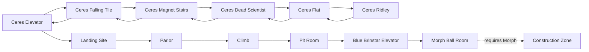

# Continuous start-to-Morph baseline

## Reproduce

From the repository root:

```bash
uv run python super_metroid/scripts/setup_rom.py
uv run python super_metroid/scripts/import_legacy_assets.py
uv run python super_metroid/scripts/export/progression_map.py
uv run python super_metroid/scripts/record/start_to_morph.py
```

Use `--no-video` for a faster machine-report-only check. Unlimited ammo is
enabled by default. `--no-unlimited-ammo` runs the same route without it.

The run starts from emulator power-on (`retro.State.NONE`) and never loads a
save state. It uses deterministic controller spans for title/intro and Ceres,
then imported room-action seeds aligned to natural Zebes room entries.

## Route



The code-owned graph is `progression.py`; its generated interchange form is
`maps/start_to_morph_graph.json`. Nodes carry room/area/tags, edges carry
directions, capability requirements, policy ownership, and verification
status, and milestones carry typed state predicates, requirements,
acquisitions, and timeouts. Runtime transitions are recorded as
`ObservedTransition` values in the run report.

## Acceptance evidence

The accepted artifact is `recordings/start_to_morph.mp4`:

- H.264, 512×448, 60 fps
- 27,075 encoded frames
- 451.25 seconds
- visibly includes first Ceres control, natural self-destruct, Zebes landing,
  descent through the early rooms, and the `MORPHING BALL` acquisition banner

`recordings/start_to_morph.json` records final collected/equipped item mask
`0x0004`, all room transitions, action-reason counts, resource-assist
telemetry, ROM hash, start condition, and zero state/progression writes.

The ammo assist makes zero writes in this prefix because Missile, Super
Missile, and Power Bomb capacities are all still zero. This is expected and
proves the “unlimited” setting cannot unlock an ammo type.
